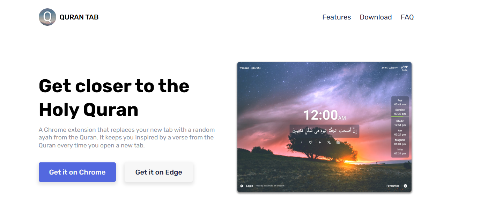

# Quran Tab Landing Page

Quran Tab is a powerful and elegant browser extension that enhances your new tab experience by displaying a random verse from the Quran every time you open a new tab. Stay inspired and connected with the Quran effortlessly!

## 🌟 Features

- 📖 **Random Quran Verses**: A new verse appears every time you open a tab.
- 🌍 **Support for 15+ Translations**: Choose your preferred translation.
- 🌐 **Multi-Language Support**: Fully translated into **English** and **Arabic**.
- 🎨 **Minimal & Clean Design**: A distraction-free reading experience.
- 📅 **Daily Ayah Mode**: Get a single verse that changes daily.
- 🎵 **Audio Recitation**: Listen to the verse with beautiful recitations.
- 🌙 **Dark & Light Themes**: Customize the look to your preference.
- ⚡ **Smooth Animations**: Powered by ScrollReveal.js for a dynamic UI.
- 🔍 **Tafsir Support**: Read explanations of the verse within the extension.

## 🚀 Installation

🔹 **Google Chrome** → [Add to Chrome](https://bit.ly/qt-chrome)  
🔹 **Microsoft Edge** → [Add to Edge](https://bit.ly/qt-edge)  
🔹 **Firefox** → *Coming Soon*

## 🎥 Live Demo
**[Live Demo]([https://your-live-demo-link.com](https://qurantab.netlify.app/))**

## 🛠 Technologies Used

This project is built using modern web technologies:

- **HTML5** → Structuring the extension UI.
- **CSS3 & SASS** → Styling with efficiency and maintainability.
- **JavaScript (ES6+)** → Adding interactivity and dynamic content.
- **Google Fonts (Rubik font family)** → Elegant typography.
- **SVG Icons** → Lightweight and scalable icons.
- **ScrollReveal.js** → Smooth animations and effects.

## 📂 Project Structure

```
📂 QuranTab
 ├── 📄 index.html  # The main landing page
 ├── 📄 style.css   # The main styles
 ├── 📄 script.js   # Handles interactivity and dynamic content
 ├── 📂 assets/     # Images, fonts, and icons
```

## 🔧 Development Setup

1. Clone the repository:
   ```bash
   git clone https://github.com/n3ssar/QuranTab.git
   ```
2. Navigate to the project folder:
   ```bash
   cd QuranTab
   ```
3. Open `index.html` in your browser or use Live Server for real-time changes.

## 🤝 Contributing

Contributions are welcome! If you'd like to improve this project:

1. Fork the repository.
2. Create a new branch (`feature-new-idea`).
3. Make your changes and commit them.
4. Submit a Pull Request.


## 📩 Contact

For inquiries or feature requests, feel free to open an issue on this GitHub repository.

---

## 📸 Screenshot



---

Thank you for using **Quran Tab**! May it bring you daily inspiration. 🤲✨

